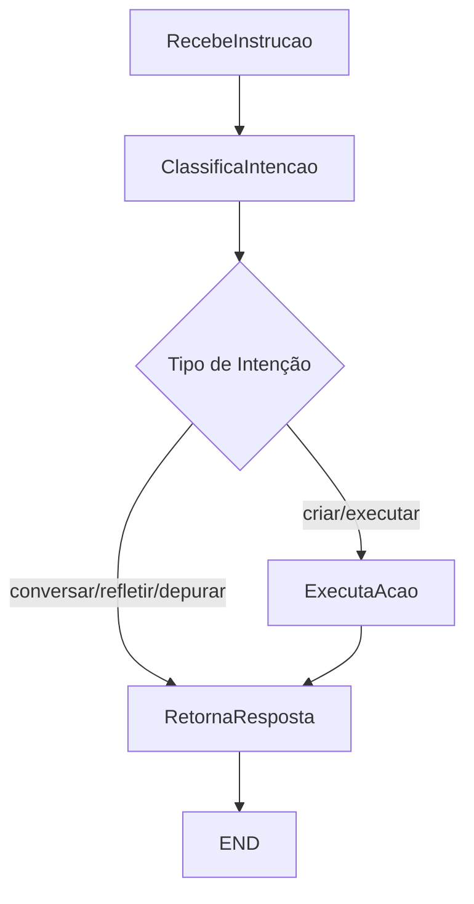

# LangChain + LangGraph Orchestration Implementation

## Visão Geral

Implementação de orquestração inteligente para o ScareVerse usando LangChain e LangGraph, com camada de classificação de intenções para processar mensagens do jogador e executar ações automaticamente.

## Arquitetura

### Componentes Principais

#### 1. **Intention Classifier** (`app/intention_classifier.py`)

Classifica mensagens do jogador em 5 categorias de intenção:

- **conversar**: Diálogo livre, sem necessidade de ação
- **criar**: Criar uma nova célula
- **executar**: Executar uma célula existente
- **refletir**: Revisar resultados ou sugerir melhorias
- **depurar**: Investigar erros ou falhas

**Implementação:**
- Usa palavras-chave e padrões regex para classificação
- Suporta português e inglês
- Frases específicas têm prioridade sobre contagem de keywords
- Ordem de prioridade quando há empate: CRIAR > EXECUTAR > DEPURAR > REFLETIR > CONVERSAR

**Exemplos:**
```python
classifier = IntentionClassifier()

# Conversa
classifier.classify("Olá, como você está?")  # → CONVERSAR

# Criação
classifier.classify("Criar uma célula para análise de dados")  # → CRIAR

# Execução
classifier.classify("Execute a célula abc-123")  # → EXECUTAR

# Reflexão
classifier.classify("Como posso melhorar isso?")  # → REFLETIR

# Depuração
classifier.classify("Investigar o erro na célula")  # → DEPURAR
```

#### 2. **LangChain Tools** (`app/langchain_tools.py`)

Ferramentas reutilizáveis para operações com células:

- **CellTools.criar_celula_impl()**: Cria uma nova célula
  - Valida tipo de célula
  - Cria célula com dados iniciais opcionais
  - Retorna resultado da operação

- **CellTools.executar_celula_impl()**: Executa uma célula existente
  - Valida existência da célula
  - Atualiza estado (PENDENTE → EXECUTANDO → FINALIZADO)
  - Cria fragmento de execução com resultado
  - Trata erros e atualiza estado para ERRO se necessário

- **Tools para LangChain**:
  - `criar_celula_tool()`: Tool wrapper para criar células
  - `executar_celula_tool()`: Tool wrapper para executar células

#### 3. **LangGraph Orchestrator** (`app/langgraph_orchestrator.py`)

Orquestrador baseado em grafo de estados que gerencia o fluxo de processamento:

**Grafo de Estados:**



**Nós do Grafo:**

1. **RecebeInstrucao**: Ponto de entrada, inicializa o estado
2. **ClassificaIntencao**: Classifica a intenção usando o IntentionClassifier
3. **ExecutaAcao**: Executa ação usando LangChain Tools (se necessário)
4. **RetornaResposta**: Gera resposta contextualizada para o jogador

**Estado do Orquestrador (OrchestratorState):**
```python
{
    "mensagem": str,              # Mensagem do jogador
    "historico": List[Dict],      # Histórico da conversa
    "intencao": str,              # Intenção classificada
    "responsavel_id": str,        # ID do usuário
    "modelo": str,                # Modelo de IA a usar
    "acao_realizada": bool,       # Se alguma ação foi executada
    "resultado_acao": Dict,       # Resultado da ação (se houver)
    "resposta_final": str,        # Resposta gerada
    "celula_criada": Dict         # Dados da célula criada (se aplicável)
}
```

#### 4. **Integração com Endpoint** (`app/chat_router.py`)

O endpoint `/chat/processar` foi atualizado para usar o orquestrador:

```python
@chat_router.post("/chat/processar")
async def processar_intencao_chat(request, current_user):
    # 1. Validações iniciais
    # 2. Processar com LangGraph
    orchestrator = get_orchestrator()
    resultado = orchestrator.process(
        mensagem=request.intencao,
        responsavel_id=responsavel_id,
        modelo=modelo,
        historico=historico_dicts
    )
    
    # 3. Aprimorar resposta com LLM para conversas
    if resultado["intencao"] == "conversar":
        # Chamar Ollama ou Gemini para resposta mais natural
        
    # 4. Retornar resposta + célula criada (se aplicável)
    return ProcessarIntencaoChatResponse(
        resposta=resposta_base,
        celula=celula_criada
    )
```

## Fluxos de Uso

### Fluxo 1: Conversa Livre

```
Jogador: "Olá, como você está?"
    ↓
[RecebeInstrucao]
    ↓
[ClassificaIntencao] → CONVERSAR
    ↓
[RetornaResposta] → Chama LLM (Ollama/Gemini)
    ↓
Resposta: "Olá! Estou bem, obrigado por perguntar..."
```

### Fluxo 2: Criação de Célula

```
Jogador: "Criar uma célula para análise de dados"
    ↓
[RecebeInstrucao]
    ↓
[ClassificaIntencao] → CRIAR
    ↓
[ExecutaAcao] → CellTools.criar_celula_impl()
    ↓
[RetornaResposta]
    ↓
Resposta: "✅ Célula criada com sucesso! ID: abc-123"
+ Dados da célula criada
```

### Fluxo 3: Execução de Célula

```
Jogador: "Execute a célula abc-123"
    ↓
[RecebeInstrucao]
    ↓
[ClassificaIntencao] → EXECUTAR
    ↓
[ExecutaAcao] → CellTools.executar_celula_impl()
    ↓
[RetornaResposta]
    ↓
Resposta: "Célula executada com sucesso! Resultado: ..."
```

## Testes

### Testes do Intention Classifier

**Arquivo:** `backend/tests/test_intention_classifier.py`

- 11 testes cobrindo todas as categorias de intenção
- Testes de frases em português e inglês
- Testes de padrões específicos e priorização

**Executar:**
```bash
cd backend
pytest tests/test_intention_classifier.py -v
```

### Testes de Integração do Orquestrador

**Arquivo:** `backend/tests/test_orchestration_integration.py`

- 10 testes cobrindo o fluxo completo de orquestração
- Testes de cada nó do grafo
- Testes de criação e execução de células
- Mocks para evitar dependências do banco de dados

**Executar:**
```bash
cd backend
pytest tests/test_orchestration_integration.py -v
```

**Todos os 21 testes passando ✅**

## Dependências Adicionadas

```
langchain==0.3.27
langchain-core==0.3.72
langchain-community==0.3.27
langgraph==0.2.49
```

**Nota:** Versões escolhidas para evitar vulnerabilidades conhecidas (CVE em langchain-community < 0.3.27)

## Compatibilidade com Frontend

A implementação mantém compatibilidade total com o frontend existente (`cockpit-vue/src/components/ChatIA.vue`):

- Formato de request/response inalterado
- Campo `celula` no response agora pode conter dados da célula criada
- Histórico de conversa funciona normalmente
- Seleção de modelo (Ollama/Gemini) preservada

## Próximas Melhorias

### Curto Prazo
1. **Execução de Comandos**
   - Criar células tipo `Execucao`
   - Executar comandos shell/Python
   - Retornar logs em tempo real

2. **Extração de Cell ID**
   - Melhorar extração de IDs de célula de mensagens naturais
   - Usar LLM para identificar referências a células

3. **Persistência de Sessões**
   - Manter estado da conversa entre sessões
   - Armazenar contexto e memória

### Médio Prazo
1. **Múltiplos Agentes**
   - Agente especialista para cada tipo de célula
   - Coordenação entre agentes
   - Delegação de tarefas

2. **Templates e Workflows**
   - Templates de células em YAML
   - Workflows complexos com múltiplas etapas
   - Execução paralela de células

3. **Visualização do Fluxo**
   - Mapa visual do grafo de execução
   - Status em tempo real no cockpit
   - Interação com mascotes

### Longo Prazo
1. **Aprendizagem**
   - Feedback do usuário sobre classificações
   - Ajuste automático de heurísticas
   - Modelos personalizados por usuário

2. **Integração Avançada**
   - RAG (Retrieval-Augmented Generation) para documentação
   - Busca semântica em células existentes
   - Recomendações proativas

## Exemplos de Uso

### Via API

```bash
# Criar uma célula
curl -X POST http://localhost:8000/api/chat/processar \
  -H "Content-Type: application/json" \
  -H "Authorization: Bearer $TOKEN" \
  -d '{
    "intencao": "Criar uma célula para análise de JSON",
    "modelo": "mistral",
    "historico": []
  }'

# Resposta
{
  "resposta": "✅ Célula criada com sucesso!\n\n**ID da Célula:** `abc-123`\n\nA célula foi criada...",
  "celula": {
    "id": "abc-123",
    "tipo": "tipo-celula-123",
    "estado": "pendente"
  }
}
```

### Via Frontend (ChatIA.vue)

O componente existente já funciona com a nova orquestração:

```javascript
// O usuário digita no chat
"Criar uma célula para processar imagens"

// O componente envia
POST /api/chat/processar
{
  intencao: "Criar uma célula para processar imagens",
  modelo: "mistral",
  historico: [...]
}

// A resposta é exibida automaticamente
// Se uma célula foi criada, o ID aparece no chat
```

## Diagrama de Arquitetura

```
┌─────────────────────────────────────────────────────────────┐
│                     Frontend (ChatIA.vue)                   │
│  ┌────────────────────────────────────────────────────┐    │
│  │  - Input do usuário                                │    │
│  │  - Histórico de mensagens                          │    │
│  │  - Seleção de modelo                               │    │
│  └────────────────────────────────────────────────────┘    │
└────────────────────────┬────────────────────────────────────┘
                         │
                         │ POST /chat/processar
                         ↓
┌─────────────────────────────────────────────────────────────┐
│                  Backend (chat_router.py)                    │
│  ┌────────────────────────────────────────────────────┐    │
│  │  1. Validações (usuário, modelo, tipos de célula) │    │
│  │  2. Chama LangGraph Orchestrator                   │    │
│  │  3. Aprimora resposta com LLM (se conversa)        │    │
│  │  4. Retorna resposta + célula criada               │    │
│  └────────────────────────────────────────────────────┘    │
└────────────────────────┬────────────────────────────────────┘
                         │
                         ↓
┌─────────────────────────────────────────────────────────────┐
│            LangGraph Orchestrator (langgraph_orchestrator)  │
│  ┌────────────────────────────────────────────────────┐    │
│  │  [RecebeInstrucao]                                 │    │
│  │         ↓                                           │    │
│  │  [ClassificaIntencao] ← IntentionClassifier        │    │
│  │         ↓                                           │    │
│  │  [ExecutaAcao] ← LangChain Tools                   │    │
│  │         ↓                                           │    │
│  │  [RetornaResposta]                                 │    │
│  └────────────────────────────────────────────────────┘    │
└────────────────────────┬────────────────────────────────────┘
                         │
          ┌──────────────┼──────────────┐
          ↓              ↓              ↓
┌──────────────┐ ┌──────────────┐ ┌──────────────┐
│ Intention    │ │ LangChain    │ │  Database    │
│ Classifier   │ │ Tools        │ │  (JSON)      │
└──────────────┘ └──────────────┘ └──────────────┘
```

## Conclusão

A implementação de LangChain + LangGraph fornece uma base sólida para orquestração inteligente no ScareVerse. O sistema é:

- **Modular**: Cada componente pode ser testado e evoluído independentemente
- **Extensível**: Fácil adicionar novas intenções, ações e agentes
- **Testável**: Cobertura completa de testes unitários e de integração
- **Compatível**: Funciona com o frontend existente sem modificações

A arquitetura está pronta para evoluir com múltiplos agentes, workflows complexos e funcionalidades avançadas conforme definido na issue original.
